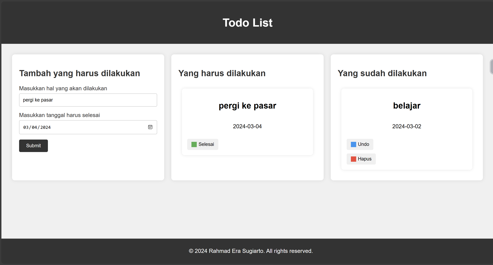

# Todo Apps

Ini adalah aplikasi Todo sederhana yang memungkinkan pengguna untuk mencatat daftar tugas yang harus dilakukan dan menandai tugas yang sudah selesai. Aplikasi ini dibangun menggunakan HTML, CSS, dan JavaScript.

## Fitur

- **Todo List**: Pengguna dapat menambahkan tugas baru ke dalam daftar todo.
  
- **Tandai Selesai**: Pengguna dapat menandai tugas yang sudah selesai dengan mengkliknya.
  
- **Hapus Tugas**: Pengguna dapat menghapus tugas dari daftar todo.

## Cara Menggunakan

1. **Tambahkan Tugas**: Ketikkan nama tugas baru ke dalam kotak input dan tekan tombol "Tambah" atau tekan tombol "Enter".
   
2. **Tandai Selesai**: Klik pada tugas yang sudah selesai untuk menandainya.
   
3. **Hapus Tugas**: Klik pada ikon "Hapus" di sebelah kanan tugas untuk menghapusnya dari daftar.

## Preview

## Teknologi yang Digunakan

- HTML
- CSS
- JavaScript

